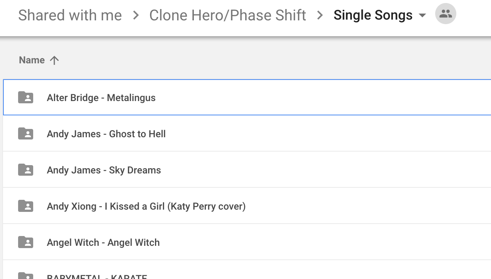

# Adding charts to chorus

**Before reading any of this, please search for your own charts on chorus: they might already be indexed!**

You can send your list of charts in one of 3 ways:

## Google Drive

Your Google Drive folder has to match the following structure:

* One folder or archive (.zip, .rar...) per song
* Names have to match `<artist name> - <song name>`

If your folder follows the above guidelines, you can replace the values between quotes in [this file](google-drive.js) and [send it](#sending-your-file).

If your folder/archive names format doesn't match the above, but still is consistent (and you're too lazy to rename them all), you can implement your own name parser as a nameParser argument. [Here is an example](../sources/digitalsquirrel.js).

If your drive structure is categorized in subfolders (e.g. discographies with one subfolder per album), you can copy/paste the script for [BABYMETAL's discography](../sources/discographies/babymetal.js) and replace the values for `ROOT_FOLDER`, `ARTIST` and `SOURCE_NAME`.

If your drive structure is more complicated (e.g. subfolders within subfolders), you will have to implement your own import script. For instance, [here is the script that imports C3 conversions](../sources/c3.js).

If you have a non-Google repository, as long as you can get a list of links somehow (e.g. with an API) along with their associated song and artist/band names, you can implement your own import script. [Example with my own charts](../sources/paturages.js).

Note that I am currently unable to download archives of packs and parse them: **you have to be able to provide separate links for each song**. 

If you are unable to provide an implementation of your import script, feel free to submit an issue on GitHub or DM `Paturages#9405` on Discord so we can figure this out.

## Plain text form

Fill in the [template text file](plain-text.txt) and [send it](#sending-your-file).

## Excel file

For convenience (especially if you have a lot of songs), the plain text form is also [available as an Excel file](https://github.com/Paturages/chorus/raw/master/source-examples/excel.xlsx). You can fill it as is and [send it](#sending-your-file).

## Sending your file

Either upload or directly write the file in the [sources](../sources) folder with your GitHub account (register if you don't have one),
or DM `Paturages#9405` on Discord with your file. The requests will be manually approved whenever I get time to process them.  

You can also update existing plain text sources directly on GitHub (if you have an account): this should send a pull request that I will manually approve, again, whenever I get time to do that.
